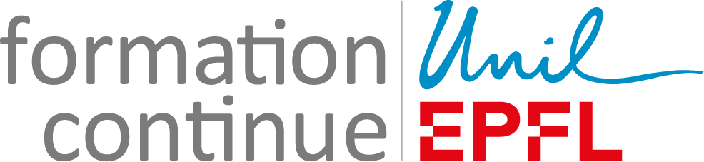

# Applications of Machine Learning

This repository contains the material for the workshop on Applications of Machine Learning. The workshop is divided into two parts:

**Introduction**: This part provides a comprehensive introduction to machine learning, explaining fundamental concepts and laying the groundwork for the hands-on session. You will be able to find presentation slides in PDF format [here]() at the end of the workshop.

**Text Classification**: In this part you will learn about text classification as a supervised learning problem. You will dive into the realm of natural language processing and learn how machines can analyze and learn from text data and text embeddings. 
We will use the [SpamAssassin](https://spamassassin.apache.org/) public email corpus. This dataset contains ~6'000 labeled emails with a ~30% spam ratio. The dataset has been downloaded for you and is available in the data folder. 
We want to build a spam detector which, given examples of spam emails and examples of regular emails, learns how to flag new emails as spam or non-spam. We define this problem as a classification task and solve it using Logistic Regression classifier. 


## Hands-On Session

To get started with the hands-on session you have the following options. Choose one by clicking on the badges below:


[](https://colab.research.google.com/github/epfl-exts/aml24-master-class/blob/main/text_classification_case_study/notebook-1.ipynb) 
[](https://mybinder.org/v2/gh/epfl-exts/aml24-master-class/c03e8f694cde6e00615d8c340f2ee93fa512f816?urlpath=lab%2Ftree%2Ftext_classification_case_study%2Fnotebook-1.ipynb)
[](https://github.com/epfl-exts/aml24-master-class/blob/main/static/notebook-1_completed.ipynb)


- **Colab**: Open the jupyter notebook in **Google Colab** to run the codes interactively on the cloud (recommended for this workshop). Note that you need to have a Google account to run the code in Google Colab.

- **Binder**: You can also interactively run the codes on a server using **Binder**. If you don't have a Google account, you can use this option. 

- **Offline View**: You can choose to take a look at the already executed notebooks in the **Offline View**. Note that with this option you cannot run the codes interactively.


Lastly, should you prefer to run the hands-on locally on your machine, there are three steps to follow:

1. **Clone or download the content**: Clone this repository from Github to your local machine using the following `git` command in your terminal. Or if you prefer to download the content manually, you can click on the  button on the top right of this page and then click on the Download ZIP.
```
git clone https://github.com/epfl-exts/aml24-master-class.git
```
<br>

2. **Install Miniconda**: Once the content of the repository is on your machine and is extracted, you can install the relevant Python dependencies with `conda`. But before that you need to install `Miniconda` on your system, if you don't have `conda` installed already. Install Miniconda on your system using this [link](https://docs.conda.io/en/latest/miniconda.html).

3. **Installation with conda**: To install the relevant Python dependencies with conda, use the following code in your terminal. This will create a virtual environment called `environment` and install all the necessary packages in it. You can then lunch the jupyter notebooks within this environment and run the code interactively.

```
conda env create -f environment.yml
```

**Note**: you need to be in the same folder as the environment.yml file to run this command.